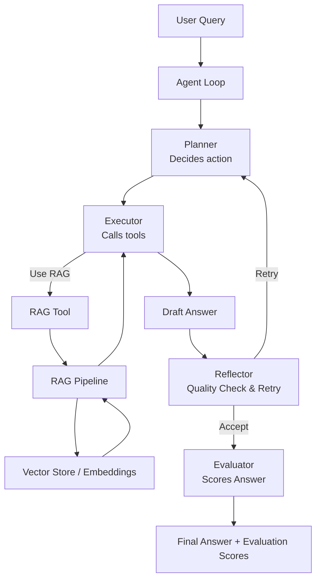

## Agentic RAG System – Architecture

# Component Responsibilities

## Planner
Determines whether document retrieval is required before answering.

## Executor
Executes the chosen action, including calling the RAG tool.

## RAG Tool
Wraps the existing RAG pipeline as a callable tool for the agent.

## RAG Pipeline
Handles chunk retrieval, vector similarity search, and response generation.

## Reflector
Evaluates answer quality and triggers retries when responses are weak or ungrounded.

## Evaluator
Scores responses based on clarity, length, and grounding.

# Design Principles

RAG is treated as a tool, not the controller.

Agent logic is framework-agnostic and transparent.

The system avoids hallucination by enforcing document grounding.

Evaluation metrics provide inspectability rather than forced optimization.